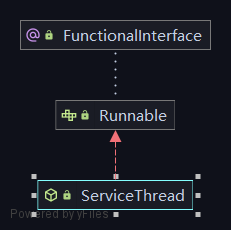

### ServiceThread
#### 结构图



#### 功能简介

```tex
其本质是就对runable类的封装，实际的作用方便对线程进行唤醒/等待/中断。
```
#### 关键属性
##### CountDownLatch2
```tex 
基于aqs同步器的一个同步工具，主要是实现了原始的CountDownLatch不能重置计数的原因
```
##### hasNotified等标识符号
```text
用volatile关键字修饰，不同线程之间的修改能被看到
```
##### 同步过程设计
```text
整体上来看，主要是通过变动标识符做到对于过程的控制。整体上是无锁的
```
#### 关键函数逻辑解析
##### waitForRunning
```text
主要的同步逻辑如下
hasNotified.compareAndSet(true, false) 判断是否已经被通知过继续运行，这里采用了compareAndSet这种方式，好处是这里采用了乐观锁的方案，确保了原子性也就是判断与修改这一步是不可分的。避免了多个线程同时读到了hasNotified=true然后触发了hasNotified=false的情况。
```

